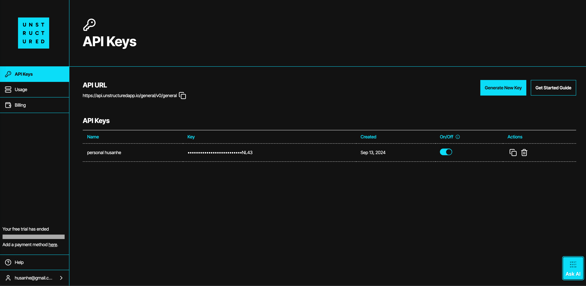
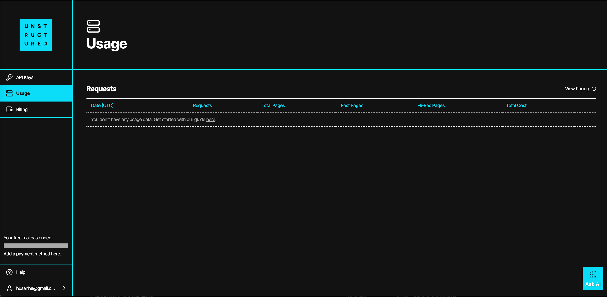

Voice Doc AI Workflow
==============================================================================
这篇文档介绍了, 如何借助 AI 工具, 从 0 开始, 构建一个专门帮我写书面文档的 AI 小助手. 我们将展示, 如何只经过一次构建, 就可以在不同的项目中使用这个 AI, 并且让 AI 在为不同项目工作时具有项目相关的特有经验, 从而给出更高质量的回答.

准备部署.

- 注册 OpenAI 账号: https://platform.openai.com/login?launch
- 下载并安装 ChatGPT 桌面版: https://openai.com/chatgpt/download/
- 注册 Claude 账号: https://claude.ai/

.. note::

    - 所有的 AI 对话都是用 ChatGPT 进行语音转文字, 然后在 Claude 中进行处理.
    - 这篇文档中的 Input 是我们的输入, Output 是 AI 的输出.


1. 创建 Claude Project
------------------------------------------------------------------------------
这一步用于创建 AI 工具所需的 Claude Project.

Input:

    我有一个项目,它是一个AI的工具。 这个AI的工具能够将我用语音输入的文字, 将其整理成各种各样的结构化的文稿, 使得我能够更加高效地来撰写更加详细、 清晰的技术文档,使得我跟我的同事之间的协作和沟通变得更加容易。 它主要是为了解决当我们用文档来精确地传达我们的信息的时候, 我们需要花很多时间去思考组织语言,并且对语言进行修改和打磨。 在AI的工具的帮助下,我们就可以非常轻松地专注于让我们用语音来进行高效地输入, 然后从而专注于我们要表达的观点,然后交给AI来帮我们打磨我们的文字。 基于这个背景信息,请你给我的项目,也就是AI工具,想一个名字。

Output:

    你的AI项目名称可以叫做 “SpeakDraft” 或 “VoiceDoc”，强调语音输入与文档输出的便捷性。这个名字能够传达出你的工具核心功能：通过语音来生成清晰、结构化的文稿，让用户更专注于内容本身，而不是文案打磨。

Input:

    请帮我为这个项目写一段Description,来介绍这个项目是用来做什么的。

Output:

    项目简介：

    “Voice Doc” 是一款智能文档生成工具，专为希望高效撰写和组织技术文档的用户设计。通过将语音输入转换为结构化文档，Voice Doc 让您可以专注于表达核心思想，而无需花费大量时间去推敲文字表述。

    Voice Doc 的 AI 算法能精准解析您的语音内容，将其整理为条理清晰、逻辑严谨的文稿格式，适合直接分享、发布或进一步编辑。无论是编写技术文档、制作报告，还是与团队分享专业见解，SpeakDraft 都能让沟通与协作更加顺畅。通过减少文字打磨和组织语言的时间，它帮助用户专注于思维输出，提高整体文档处理效率。

    适用场景：

        - 技术团队间的高效沟通与协作
        - 快速生成技术报告、使用手册等专业文档
        - 任何需要精准表达和结构化记录的场合

然后将项目名称和 Description 复制到 Claude Project 内既可.


2. 生成提示词
------------------------------------------------------------------------------
这一步用于撰写一个高质量的提示词, 使得我们能获得更高质量的回答, 以及让 AI 在工作时服从我们给出的特殊要求.

Input:

    我现在需要你帮我写一段给AI用的prompt,基于我前面的项目的需求,以及我对AI工具的要求,我希望你能帮我写一段提示词, 能够确保AI工具能够准确的理解我所想要它帮助做的事情,以及能够返回更加高质量的输出结果。 其中我想要AI帮我做的事情是,我希望AI能够将我的语音输入的文本整理成结构化的逻辑通顺,简洁并且表达清晰没有歧义的文档。 我的语音输入的文本可能存在逻辑上的不连贯,也可能出现文字用词上的表达的错误,请你基于你自己的常识以及行业知识来推断我正确的表达和输入应该是什么。 当你发现不能够做出决定的时候,请你帮我向我提问,然后让我来给你提供更多的信息来准确的传达我想要传达的意思。 并且呢,就这样吧,请你给我输出一个prompt提示词。

Output:

    我来帮你编写一个详细的 prompt，以确保 AI 能准确理解并完成你的需求。

    .. code-block:: markdown

        # 角色与目标
        你现在是一位专业的文档编辑与优化专家。你的主要任务是将我的语音转文本内容转换成结构清晰、逻辑连贯的书面文档。

        # 具体要求
        1. 文档重构
        - 分析输入文本的整体结构和逻辑关系
        - 重新组织内容，确保段落之间的连贯性
        - 保持原意的同时，优化表达方式使其更加清晰

        2. 语言优化
        - 纠正不准确或不恰当的用词
        - 消除语义歧义
        - 使用简洁、专业的表达方式
        - 确保文字表达符合书面语规范

        3. 专业判断
        - 基于行业知识和常识，推断并修正可能的错误表达
        - 在遇到无法确定的内容时，列出具体问题并请求澄清
        - 提供修改建议时说明理由，便于确认

        4. 互动反馈
        - 当需要额外信息时，提出清晰具体的问题
        - 列举可能的理解方向，请求确认
        - 在重要修改处标注并说明修改原因

        # 输出格式
        请按以下格式输出：

        1. 结构化文档
           - 标题
           - 主要内容（分段落组织）
           - 重点内容标注

        2. 修改说明
           - 主要修改内容列表
           - 修改原因说明

        3. 需要确认的问题（如有）
           - 列出需要澄清的具体问题
           - 提供可能的选项供选择

        # 特别说明
        - 保持文档的专业性和正式性
        - 确保修改后的内容准确传达原始意图
        - 在保持原意的基础上精简表达
        - 注重文档的可读性和实用性

    请基于以上要求，帮助我优化语音转文本的内容。如有任何需要确认或澄清的地方，请直接提出。

    我已经为你创建了一个详细的 prompt。这个 prompt 的设计考虑了以下几个关键点：

    1. 明确定义了 AI 的角色和任务目标
    2. 提供了具体的工作要求和标准
    3. 设置了清晰的输出格式要求
    4. 包含了互动确认机制

    使用这个 prompt 时，AI 将能够：
    - 系统地处理你的语音转文本内容
    - 在遇到不确定内容时主动寻求确认
    - 提供结构化且专业的输出结果

    你可以根据具体使用场景对这个 prompt 进行调整。比如，是否需要我调整某些具体要求或添加其他特定的处理规则？

然后将提示词填到 Custom Instruction 中.


3. 为你要解决的问题设置一些背景信息
------------------------------------------------------------------------------
在连续不断的长对话中, 给 AI 设置一些项目背景信息能大大提高输出质量以及减少频繁输入重复信息.

假设我们设计了一个 UI 的草图以及 UX 的逻辑, 我们希望将其精确的传达给我们的 Software Engineer, 按照我们的想法实现. 这里我们用 https://app.unstructured.io/ 来为例. UI 的草图如下:

Input:

    下面我将会讲述一段关于某个项目的背景信息。 我希望您能够将我的语言表述整理成一个比较简单的背景信息文档。 下面我要开始讲述了。 在这个项目中,我设计了一个UI的界面的草图, 以及我想清楚了用户在跟UI交互的过程中的点击每个按钮, 每个按钮会出现什么变化,以及这些交互逻辑。 我希望能够用屏幕的截图以及用文档来精确地描述这个UI的设计, 以及UX Experience的这个交互逻辑。 我希望将这个东西变成一篇文档, 能够使得我的工程师能够按照我的想法能够去精确地去实现。 请将以上信息整理成背景信息文档。

Output:

    .. code-block:: markdown

        # UI/UX 设计文档化需求说明

        ## 一、项目背景
        本项目旨在将已完成的UI界面设计和交互逻辑转化为详细的技术文档，以供开发团队实现。

        ## 二、现有成果
        1. UI设计草图
        2. 完整的用户交互流程
        3. 按钮交互逻辑设计

        ## 三、文档化目标
        ### 主要目标
        将设计方案转化为可执行的技术文档，确保开发团队能够准确实现设计意图。

        ### 具体内容要求
        1. UI界面展示
           - 界面截图说明
           - 界面元素详细说明

        2. 交互逻辑说明
           - 用户操作流程
           - 按钮触发效果
           - 界面状态变化说明

        ## 四、预期交付物
        一份包含UI设计和交互逻辑的完整技术文档

        # 修改说明
        1. 将零散的表述重组为结构化文档
        2. 明确了文档化的具体目标和内容要求
        3. 增加了预期交付物说明
        4. 使用专业术语规范表达

        # 需要确认的问题
        1. 是否需要包含具体的技术规格说明？
        2. 是否需要添加时间节点或里程碑说明？
        3. 是否需要细化具体的文档格式要求？


将以上文档保存为 Project-Background.md 并上传到 Knowledge base 中.


4. 将口述文档转化成书面文档
------------------------------------------------------------------------------
现在我们可以开始真正干活了. 下面是文档中的参考配图, 我们也是照着这个图片来描述的.





Input:

    我上传了两个我们的UI设计的截图。 下面我将会口述这个UI设计以及UX互动逻辑。 请你将我的口述内容转化成文档。 我希望我的工程师能够根据我的文档照着去实现他的这个UI的功能。 下面我们开始。 首先我们是请看图1,也就是Unstructured IO API Key这个Tab。 这个Tab上有几个元素。 首先第一个元素是它左边的侧边栏,也就是相当于是一个一级菜单。 在这个一级菜单里面我们有几个选项,其中最上面的选项就是API Key。 点击API Key这个菜单,它就会在右边这个展示区域展示出这个API Key的详细信息。 其中API Key的详细信息有这么几个元素。 第一就是Title,最上面的这个一个API Key的图标,以及告诉用户我们这个Tab是API Key的这个页面。 第二个是API URL,然后它是一个URL,也就是用户在调用API的时候他要发送的那个URL。 其中它有一个Copy Button,点击即可拷贝那个API URL。 然后是两个按钮,一个是叫做Generate New Key,点击这个以后就会弹出一个Pop-up Window来创建一个新的API Key。 在Pop-up Window里主要输入这个新的API Key的名字。 第二个按钮叫做Get Started Guide,它会自动导到我们公司网站上的一个文档的链接, 是教会用户怎么去使用API Key。 其中这个Generate New Key呢,它要高亮,使用整个UI的Primary Color。 然后呢,它的在下面的部分呢,会展示用户拥有的所有的API Key的列表。 其中API Key它有五个字段,第一个叫做Name,也是API Key的名字。 第二个是Key,是这个API Key的这个具体的Value。 当然为了防止泄露,我们需要隐藏大部分的字符,只留大概最后面四个字符。 第三呢,就是叫Created,就是告诉用户这个API Key是什么时候Created的,只保留年月日即可。 第四个呢,是On and Off,是一个开关,如果把这个开关给关掉,这个API Key就不能够使用了。 但是API Key本身并没有删除,这个功能有助于使用户在怀疑自己的API Key遭到泄露的时候, 它可以临时将其关闭,然后进行排查。 最后一个呢,是Column,就是Action,它就是一些快捷图标。 然后它比如说,它第一个图标是它可以点击一个Copy的图标能够复制API Key, 或者它点击那个垃圾桶的图标可以删除这个API Key。 这个API Key呢,它是一个二维的表格, 用户可以通过点击Header来对表格中的数据进行排序。 然后由于这个用户可能会创建非常多个API Key, 所以这个API Key这个页面呢,它会有一个Pagination,就是分页的功能。 比如说每页只展示10个API Key, 但是用户可以翻下一页下一页,然后去浏览它所有的API Key。 至此,API Key的这个页面,也就是那个Image已经介绍完毕。 下面我们开始介绍Unstructured IO Usage这个Tab的这个图片。 在这个Usage这个图片呢,其他的都跟原来比较类似, 它也是在左边,是一个一级菜单。 点击以后会进入到Usage这个页面。 这个Usage页面的上面是一个Title, 然后下面的是一个表格。 这个表格呢,由下面几个字段, 这个表格展示的是所有用户使用API Key发起的这个Request的历史记录。 其中这个Request呢,它包含这么几个字段。 第一个是Date,UTC的时间, 也就是用户什么时候发起的这个Request。 第二个Column是Request次, 它是说明这个用户的这个Request的唯一的ID。 然后呢,后面还有Total Page, 是它的第三个Column,内容我就不介绍了。 第四个Column是Fast Pages,我也不介绍了。 第五个Column是High Resolution的简写,High Res Page, 这个我也不介绍了。 最后一个Column是Total Cost, 也就是展示这个API产生了多少的费用。 用户可以通过观察这个Usage这个表格来了解, 最近用户用这个API的使用情况, 也可以对用户它即将收到多少账单有一个预期。 好的,就这样。 然后请你将以上的文字,文稿组织成一个文档。 最好能够考虑到我们读者是程序员, 也就是Software Engineer, 请把这个文档整理成更加能够被他们更容易去理解和消化的形式, 以及它可以用这个文档作为一个reference来一步一步的去执行, 来实现我们所有的UI的元素以及UI的逻辑。

Output:

    .. code-block:: markdown

        # Unstructured IO API管理界面技术规格文档

        ## 1. 整体布局结构

        ### 1.1 导航栏
        - 位置：页面左侧
        - 类型：垂直导航菜单
        - 主要选项：
          - API Keys
          - Usage
          - Billing（供参考）

        ### 1.2 主内容区
        - 位置：页面右侧
        - 动态渲染：根据左侧导航选择显示对应内容

        ## 2. API Keys页面详细规格

        ### 2.1 页面标题区
        - 标题图标：API Key图标
        - 标题文本：API Keys
        - 样式要求：与整体设计风格保持一致

        ### 2.2 API URL区域
        ```
        URL格式：https://api.unstructuredapp.io/general/v0/general
        功能要求：
        - 显示完整API URL
        - 提供复制按钮
        - 复制成功需要有视觉反馈
        ```

        ### 2.3 操作按钮区
        1. Generate New Key按钮
           - 样式：使用系统Primary Color
           - 交互：点击触发创建新Key的弹窗
           - 弹窗要求：
             - 包含名称输入字段
             - 确认和取消按钮
             - 创建成功后自动刷新列表

        2. Get Started Guide按钮
           - 样式：次要按钮样式
           - 功能：链接到外部文档页面
           - 打开方式：新窗口

        ### 2.4 API Keys列表
        - 实现方式：数据表格
        - 分页设置：每页10条记录
        - 排序功能：支持所有列的排序

        列表字段定义：
        1. Name
           - 类型：文本
           - 说明：API Key的名称

        2. Key
           - 类型：加密文本
           - 显示规则：仅显示最后4个字符，其他用*代替
           - 复制功能：支持完整密钥复制

        3. Created
           - 类型：日期
           - 格式：YYYY-MM-DD
           - 时区：本地时间

        4. On/Off
           - 类型：开关按钮
           - 功能：控制API Key的启用状态
           - 状态保持：需要持久化存储

        5. Actions
           - 复制按钮：复制完整API Key
           - 删除按钮：删除当前API Key
           - 确认机制：删除操作需二次确认

        ## 3. Usage页面详细规格

        ### 3.1 页面标题区
        - 标题文本：Usage
        - 位置：页面顶部

        ### 3.2 使用记录表格
        - 实现方式：数据表格
        - 分页功能：支持
        - 数据刷新：自动/手动刷新机制

        列表字段定义：
        1. Date (UTC)
           - 类型：日期时间
           - 格式：按UTC时间显示

        2. Requests
           - 类型：唯一标识符
           - 显示：完整Request ID

        3. Total Pages
           - 类型：数值
           - 对齐：右对齐

        4. Fast Pages
           - 类型：数值
           - 对齐：右对齐

        5. Hi-Res Pages
           - 类型：数值
           - 对齐：右对齐

        6. Total Cost
           - 类型：货币值
           - 格式：带货币符号
           - 对齐：右对齐

        ## 4. 通用交互规范

        ### 4.1 表格交互
        - 支持列排序
        - 点击表头切换排序方向
        - 显示排序状态指示器

        ### 4.2 分页功能
        - 页码导航
        - 每页显示数量选择
        - 总记录数显示

        ### 4.3 状态反馈
        - 操作成功提示
        - 错误信息展示
        - 加载状态指示

        ### 4.4 响应式设计
        - 支持不同屏幕尺寸
        - 合理的断点设置
        - 移动端优化

        ## 5. 技术注意事项

        ### 5.1 安全性
        - API Key的安全存储
        - 敏感信息的加密展示
        - 操作权限控制

        ### 5.2 性能优化
        - 表格数据懒加载
        - 分页查询优化
        - 缓存机制实现

        ### 5.3 错误处理
        - 网络请求超时处理
        - 数据加载失败处理
        - 用户操作错误反馈

Input:

    非常好,这篇结构化的技术文档的内容非常简洁, 但是信息不够完整,可能会让software engineer有一些疑惑和不理解。 我希望你根据我前面的口述的信息,整理成一份narrative格式的文档。 当然,这个文档的本身,我希望你能够把它划分为多个段落,使得其更加容易阅读。 但是整体文档的风格,请使用叙述性的语言来进行描述。 现在请你帮我撰写这篇叙述性的文档。

Output:

    .. code-block:: markdown

        # Unstructured IO API管理界面设计说明文档

        ## 界面概述

        我们的API管理界面采用了现代化的左右分栏设计布局。左侧是一个垂直导航栏，作为用户的主要导航入口；右侧则是宽大的内容展示区域，用于显示具体的功能页面。这种布局设计不仅符合用户的使用习惯，也为未来功能的扩展预留了足够的空间。

        目前，左侧导航栏包含了几个核心功能入口，其中最重要的是"API Keys"和"Usage"这两个选项。让我们详细了解这两个主要功能页面的设计。

        ## API Keys 管理页面

        ### 页面布局与核心元素

        当用户点击左侧导航栏中的"API Keys"选项时，右侧内容区域会展示出完整的API密钥管理界面。这个页面的顶部醒目地展示着页面标题，配有一个形象的API Key图标，让用户能够立即确认自己的位置。

        紧接着标题的下方，用户会看到一个重要的API URL显示区域。这个区域展示了调用API时需要使用的基础URL：`https://api.unstructuredapp.io/general/v0/general`。考虑到开发者的使用便利性，我们在URL旁边放置了一个复制按钮，点击即可将完整的URL复制到剪贴板。

        ### 功能按钮区

        在页面的操作区域，我们设计了两个主要的功能按钮：

        1. "Generate New Key"按钮使用了我们的主题色，它的显眼位置传达了这是最常用的操作之一。点击这个按钮会弹出一个简洁的对话框，用户只需要输入新API密钥的名称即可完成创建。

        2. 旁边的"Get Started Guide"按钮则链接到我们的官方文档，为新用户提供了直接的入门指南入口。

        ### API密钥列表设计

        页面的主体部分是一个功能完备的API密钥列表表格。这个表格包含了五个精心设计的列：

        - Name列显示每个API密钥的名称，帮助用户识别不同密钥的用途
        - Key列以安全的方式显示API密钥，只展示最后四个字符，其余部分用星号遮掩
        - Created列记录密钥的创建日期，采用清晰的年-月-日格式
        - On/Off列提供了一个直观的开关控制，让用户能够快速启用或禁用某个密钥，而不需要删除它
        - Actions列集成了复制和删除两个常用操作的快捷按钮

        考虑到实际使用场景，我们在表格中实现了全面的排序功能，用户可以点击任何列标题进行排序。同时，为了处理大量API密钥的情况，我们实现了分页功能，每页显示10个条目，下方配有完整的分页控制器。

        ### 安全性考虑

        我们特别注意API密钥的安全性设计。除了默认隐藏大部分密钥字符外，复制功能也经过特别设计，确保密钥不会意外暴露在界面上。当用户怀疑密钥可能泄露时，可以通过开关快速禁用相应的密钥，而不是直接删除它，这给了用户更多的操作空间。

        ## Usage 数据统计页面

        ### 页面结构

        Usage页面采用了清晰的表格式布局，旨在帮助用户直观地了解API的使用情况。表格包含多个精心设计的列：

        - Date(UTC)：记录请求的确切时间，统一使用UTC时间以避免时区混淆
        - Requests：显示每个请求的唯一标识符，方便追踪和调试
        - Total Pages：展示处理的总页数
        - Fast Pages：显示快速处理的页数
        - Hi-Res Pages：记录高分辨率处理的页数
        - Total Cost：清晰地显示每次请求产生的费用

        ### 使用体验优化

        考虑到这个页面主要用于数据分析和费用追踪，我们实现了完善的排序和筛选功能。用户可以通过点击列标题对数据进行排序，这对于分析使用模式和费用趋势特别有帮助。

        ## 通用交互设计

        在整个界面设计中，我们特别注重以下几个方面：

        1. 响应式反馈：任何用户操作都会得到即时的视觉反馈，比如复制操作的成功提示，或删除操作的确认对话框。

        2. 错误处理：系统会优雅地处理各种可能的错误情况，并通过友好的提示信息指导用户进行正确的操作。

        3. 数据刷新：表格数据会定期自动刷新，确保用户看到的始终是最新信息。同时，用户也可以手动刷新数据。

        ## 实现建议

        对于开发团队，我们建议特别注意以下几点：

        1. 数据缓存：考虑实现合适的缓存策略，特别是对于Usage页面的历史数据。

        2. 错误处理：建立完整的错误处理机制，包括网络超时、服务器错误等异常情况的处理。

        3. 安全性：在实现API密钥相关功能时，务必采取必要的安全措施，确保密钥信息的安全性。

        4. 性能优化：对于列表页面，建议实现分页加载和虚拟滚动等优化措施，以提升大数据量下的性能表现。

        这个界面设计注重实用性和用户体验，每个功能的设计都经过仔细考虑，目的是为用户提供一个既直观又高效的API管理工具。


5. 做其他项目
------------------------------------------------------------------------------
重复 3, 4 的步骤既可.


6. Voice Doc AI 工作流总结
------------------------------------------------------------------------------
**核心优势**

1. 零起点工作流
    - 整个工作流程无需预先准备任何资源
    - 项目背景信息和AI提示词都可以通过AI协助生成
    - 通过AI预处理提示词和背景信息, 显著提升后续回答质量
2. 高效的语音输入
    - 采用 OpenAI 作为核心语音输入工具
    - 口述输入效率远高于手动打字
    - 支持将口述内容进行智能分段和格式化处理
    - 可以在保持内容不变的情况下，优化文档结构
3. Claude 的项目管理优势
    - 提供 Project, Custom Instruction 和 Knowledge Base 功能
    - 允许存储和复用项目背景信息，避免重复输入
    - 能够参考已有文档风格和结构
    - 可以在instruction中指定参考特定文档的结构和语言风格
4. 工作流程的特点
    1. 预处理阶段
       - 使用AI生成项目背景信息
       - 创建适配项目需求的提示词
       - 建立项目知识库
    2. 内容生成阶段
       - 通过语音快速输入原始内容
       - 利用OpenAI进行初步处理
       - 使用Claude进行深度优化和格式化
    3. 文档优化阶段
       - 根据项目背景进行内容调整
       - 参考已有文档保持风格一致
       - 确保专业性和准确性

**工具选择理由**

OpenAI 的优势

- 优秀的语音识别能力
- 快速的内容处理能力
- 适合初步内容生成

Claude 的优势

- 更保守和严谨的处理风格
- 更适合处理正式的商业项目
- 输出更加可靠和负责任
- 提供完善的项目管理功能

**最佳实践建议**

1. 知识库管理
   - 及时更新项目相关资料
   - 保持文档模板和风格指南的更新
   - 积累常用的提示词模板
2. 工作流优化
   - 根据项目需求调整提示词
   - 建立标准化的文档处理流程
   - 定期审查和优化工作流程
3. 质量控制
   - 定期检查AI输出的准确性
   - 确保文档风格的一致性
   - 维护专业术语词库

这个工作流程通过合理组合不同 AI 工具的优势, 创建了一个高效的文档生成系统. 它不仅提高了文档创建的效率, 也确保了输出内容的质量和一致性. 通过精心设计的流程和工具选择, 使得复杂的文档创建工作变得更加简单和可控.
